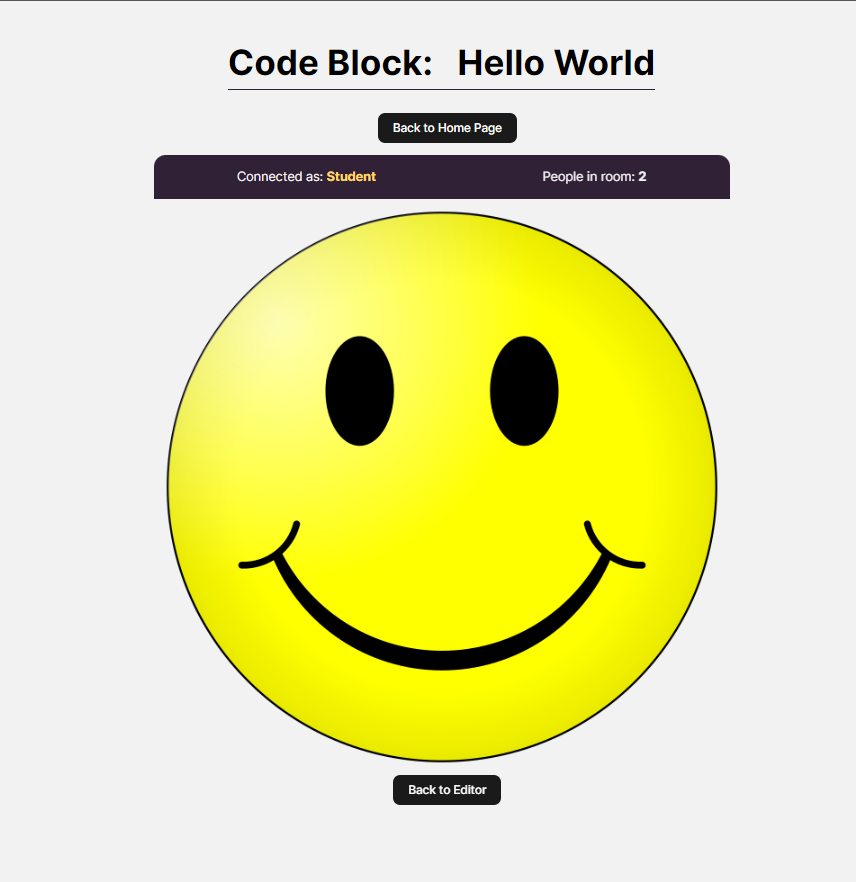

# Coding Platform

A real-time multi-user Javascript coding platform!

## Lobby
Each code block is designed to be a standalone lesson. The first user to enter a code block becomes the mentor, while all subsequent users who join (as long as the mentor is still present) will be students.

## Code Block Page
Upon entering the code block, users will see their assigned role (mentor or student) and the number of people currently in the room. The code editor is connected to a socket, enabling students to collaborate in real-time by writing code together. Users can also run the code independently of each other and see the results. The mentor has read-only access and cannot modify the code. When the mentor leaves the room, all students are redirected to the lobby. If the students successfully solve the code block task, a large smiley face will appear on the screen.

### Mentor

### Student

### When task is solved:

